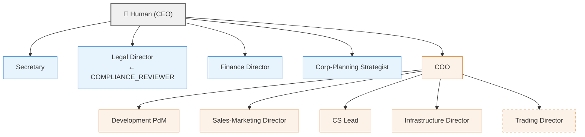

# Organization Chart Template

## Overview

This document provides a bird's-eye view of the recommended organizational hierarchy, department placement, and cross-department collaboration flows for AnimaWorks.
The design is based on a typical organizational structure (staff/line separation) found in Japanese IT companies with approximately ¥5 billion annual revenue.

### How to Use

1. **Recommended Org Chart** — Understand the overall placement of staff and line functions
2. **Department Directory** — Refer to detailed templates for each team
3. **Cross-Department Handoff Map** — Review flows that span departments
4. **Phased Adoption Guide** — Choose adoption steps that match your organization's scale

---

## Recommended Org Chart

### Organizational Hierarchy (Mermaid)



### Staff / Line Classification

| Department | Type | Recommended supervisor | Summary | Template |
|-----------|------|----------------------|---------|----------|
| Secretary | Staff | `null` (CEO-direct) | Information triage, proxy sending, document creation | `team-design/secretary/team.md` |
| Legal | Staff | `null` (CEO-direct) | Contract review, compliance verification, legal research | `team-design/legal/team.md` |
| Finance | Staff | `null` (CEO-direct) | Financial analysis, audit, data collection | `team-design/finance/team.md` |
| Corporate Planning | Staff | `null` (CEO-direct) | Strategy formulation, business analysis, KPI tracking | `team-design/corporate-planning/team.md` |
| COO | Line (oversight) | `null` (CEO-direct) | Delegation decisions, department monitoring, executive reporting | `team-design/coo/team.md` |
| Development | Line | COO | Planning, implementation, review, testing | `team-design/development/team.md` |
| Sales & Marketing | Line | COO | Content production, lead development, pipeline management | `team-design/sales-marketing/team.md` |
| Customer Success | Line | COO | Onboarding, health analysis, VoC aggregation | `team-design/customer-success/team.md` |
| Infrastructure/SRE | Line | COO | Periodic monitoring, anomaly detection, escalation | `team-design/infrastructure/team.md` |
| Trading | Line (optional) | COO | Strategy, backtesting, bot operations, risk audit | `team-design/trading/team.md` |

> **Trading is domain-specific** (finance, crypto, etc.) and can be omitted for general IT companies. It is shown with a dashed border in the Mermaid diagram above.

### Design Rationale

- **All staff functions use `supervisor: null` (CEO-direct)**: Legal and Finance are not placed under the COO to ensure governance independence. Corporate Planning serves as a CEO decision-support function, and Secretary is the direct interface with the human (EA)
- **Line functions are under COO oversight**: Departments involved in business execution (Development, Sales, CS, Infrastructure, etc.) are managed centrally by the COO. This also keeps the human's (CEO's) direct report count at a manageable span of control

### COMPLIANCE_REVIEWER Placement

**Recommended: Legal Director serves concurrently as COMPLIANCE_REVIEWER.**

- It is natural for CEO-direct Legal to conduct compliance verification from an independent position
- Legal Director is the intended reviewer for the Sales-Marketing `compliance-review.md` flow
- As the organization scales, a dedicated Legal Verifier can be added within the legal team (see `team-design/legal/team.md`)

---

## Department Directory

| # | Department | Type | Recommended supervisor | Role composition | Recommended `--role` | Template path |
|---|-----------|------|----------------------|-----------------|---------------------|---------------|
| 1 | Secretary | Staff | `null` | Secretary | general | `team-design/secretary/team.md` |
| 2 | Legal | Staff | `null` | Director + Verifier + Researcher | manager / researcher | `team-design/legal/team.md` |
| 3 | Finance | Staff | `null` | Director + Auditor + Analyst + Collector | manager / ops | `team-design/finance/team.md` |
| 4 | Corporate Planning | Staff | `null` | Strategist + Analyst + Coordinator | manager / researcher | `team-design/corporate-planning/team.md` |
| 5 | COO | Line (oversight) | `null` | COO | manager | `team-design/coo/team.md` |
| 6 | Development | Line | COO | PdM + Engineer + Reviewer + Tester | engineer / manager | `team-design/development/team.md` |
| 7 | Sales & Marketing | Line | COO | Director + Creator + SDR + Researcher | manager / writer | `team-design/sales-marketing/team.md` |
| 8 | Customer Success | Line | COO | CS Lead + Support | manager / general | `team-design/customer-success/team.md` |
| 9 | Infrastructure/SRE | Line | COO | Infra Director + Monitor | ops | `team-design/infrastructure/team.md` |
| 10 | Trading | Line (optional) | COO | Director + Analyst + Engineer + Auditor | manager / engineer | `team-design/trading/team.md` |

---

## Cross-Department Handoff Map

Major information flows spanning departments are listed below. Refer to the relevant team's `team.md` for details on each flow.

| # | From | To | Trigger | Handoff document | Channel |
|---|------|-----|---------|-----------------|---------|
| 1 | Sales-Marketing Director | CS Lead | Deal closed | `cs-handoff.md` | `delegate_task` |
| 2 | Sales-Marketing Director | Legal Director | Compliance risk detected | `compliance-review.md` | `send_message` |
| 3 | CS Lead | COO | Periodic VoC report | `voc-report.md` | `send_message` (intent: report) |
| 4 | COO | Development PdM | Product feedback from VoC | `voc-report.md` (forwarded via COO) | `send_message` or `delegate_task` |
| 5 | Infrastructure Director | COO | Periodic consolidated report | Consolidated report template | `send_message` (intent: report) |
| 6 | Infrastructure Director | COO + Development | CRITICAL incident escalation | Incident report | `send_message` + `call_human` |
| 7 | Corporate-Planning Strategist | COO | Strategy report / initiative proposals | `strategy-report.md` | `send_message` (intent: report) |
| 8 | Corporate-Planning Coordinator | All departments | Initiative communication / KPI tracking | Initiative notice | `send_message` or `post_channel` |
| 9 | Secretary | All teams | Inbound external message triage | Triage result | `send_message` (routing decision) |
| 10 | All team Directors/Leads | Secretary | External channel send request | Send request (approval flow) | `send_message` |

### Flow Notes

- **#1 cs-handoff**: Customer handoff from sales to CS. Includes contract terms, customer info, and onboarding schedule
- **#2 compliance-review**: When a compliance risk is detected during sales activities, Legal conducts independent verification. Legal Director judges as COMPLIANCE_REVIEWER
- **#3, #4 VoC feedback loop**: Customer voice reaches product improvement through the CS → COO → Development path
- **#6 CRITICAL escalation**: When an infrastructure incident reaches CRITICAL, COO and Development are notified simultaneously, and `call_human` escalates to the human
- **#9, #10 Secretary hub**: External channel (Gmail, Chatwork, etc.) communication is centralized through the Secretary. Inbound messages are triaged and distributed; outbound messages go through an approval flow

---

## Escalation Paths

### Line functions (under COO)

```
Attempt resolution within team
  ↓ Cannot resolve
Escalate to COO (send_message, intent: report)
  ↓ COO determines resolution impossible / human approval required
Escalate to human via call_human
```

### Staff functions (CEO-direct)

```
Attempt resolution within team
  ↓ Cannot resolve / human approval required
Escalate directly to human via call_human
```

> Staff functions have `supervisor: null`, meaning there is no intermediate Anima supervisor. Important decisions and approvals go directly to the human via `call_human`.

### CRITICAL Incidents

```
Infrastructure Director detects issue
  ↓ Simultaneous notification
├── send_message to COO (intent: report)
├── send_message to Development PdM (technical response request)
└── call_human to notify human
```

---

## Phased Adoption Guide

There is no need to set up all departments at once. Add teams incrementally as the organization grows.

### Stage 1: Personal Assistant (1 Anima)

| Anima | supervisor | Role |
|-------|-----------|------|
| Secretary | `null` | Information triage, scheduling, proxy sending |

Minimum viable setup. The human interacts with a single Anima that handles external channel integration and daily assistant tasks.

### Stage 2: Add Development (3-5 Anima)

| Anima | supervisor | Role |
|-------|-----------|------|
| Secretary | `null` | Same as Stage 1 |
| COO | `null` | Business oversight, development team management |
| Development PdM | COO | Planning and management (Engineer etc. combined or added incrementally) |

Adds the core development function. The COO begins managing line departments. Roles within the development team (Engineer, Reviewer, Tester) are added incrementally per `team-design/development/team.md` scaling guide.

### Stage 3: Add Back Office (6-8 Anima)

| Anima | supervisor | Role |
|-------|-----------|------|
| (All Stage 2) | — | — |
| Legal Director | `null` | Contract review, compliance (COMPLIANCE_REVIEWER) |
| Finance Director | `null` | Financial analysis, budgeting |
| *or* Infrastructure Director | COO | Monitoring, operations (if infra needs precede back office) |

Establishes the governance foundation. Legal and Finance report directly to the CEO for independence. Infrastructure may be added early depending on development scale.

### Stage 4: Add Customer-Facing (8-12 Anima)

| Anima | supervisor | Role |
|-------|-----------|------|
| (All Stage 3) | — | — |
| Sales-Marketing Director | COO | Lead acquisition, content production |
| CS Lead | COO | Onboarding, customer health management |
| Infrastructure Director | COO | (if not added in Stage 3) |

Builds the full customer acquisition-to-success funnel. The cs-handoff (sales → CS) and VoC feedback loop become operational.

### Stage 5: Full Configuration (12+ Anima)

| Anima | supervisor | Role |
|-------|-----------|------|
| (All Stage 4) | — | — |
| Corporate-Planning Strategist | `null` | Strategy formulation, KPI tracking |
| Trading Director | COO | *Domain-specific — can be omitted* |
| Per-team role expansion | — | See each team.md scaling section |

Adds strategic decision support via Corporate Planning. All handoff map flows are fully operational. Per-team role expansion (multiple Engineers, additional Support, etc.) follows each team.md.

---

## Customization Guidelines

### Omitting Trading

The Trading team is a domain-specific function (finance, crypto, etc.). It can be safely omitted for general IT companies. Removing Trading has no impact on the handoff map (Trading does not receive flows from other departments).

### Changing COMPLIANCE_REVIEWER Placement

Legal Director serving as COMPLIANCE_REVIEWER is recommended, but the following alternatives are possible:

- **Dedicated Legal Verifier**: Add a verification-specialist role within the legal team (see `team-design/legal/team.md`)
- **Assign to another CEO-direct Anima**: Acceptable as long as governance independence is maintained

### Phased Staff Addition

Stages 1-5 are examples. Actual priority may be adjusted based on business circumstances:

- High legal risk industry → Add Legal early in Stage 2
- Data-driven business → Add Finance Analyst role early in Stage 2
- SaaS business → Add CS early in Stage 3

### Per-Team Scaling

Role expansion within each team follows the scaling section in each team.md:

| Team | Scaling reference |
|------|------------------|
| Development | `team-design/development/team.md` §Scaling |
| Legal | `team-design/legal/team.md` §Scaling |
| Finance | `team-design/finance/team.md` §Scaling |
| Sales & Marketing | `team-design/sales-marketing/team.md` §Scaling |
| Customer Success | `team-design/customer-success/team.md` §Scaling |
| Corporate Planning | `team-design/corporate-planning/team.md` §Scaling |
| Infrastructure/SRE | `team-design/infrastructure/team.md` §Scaling |
| Trading | `team-design/trading/team.md` §Scaling |
