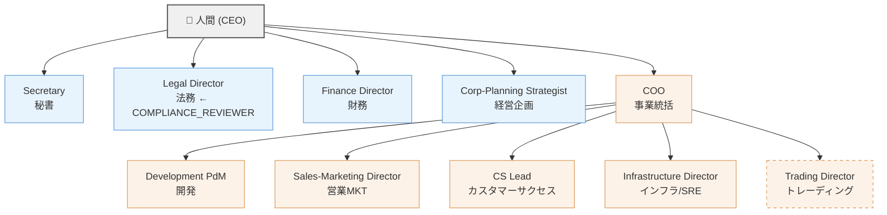

# 組織図テンプレート

## 概要

このドキュメントは、AnimaWorks で推奨する組織階層・部門配置・部門間連携フローを俯瞰するためのテンプレートである。
年商50億円規模の日本IT企業における一般的な組織構造（スタッフ/ライン分離）を基に設計されている。

### 使い方

1. **推奨組織図** でスタッフ系・ライン系の全体配置を把握する
2. **部門ディレクトリ** で各チームの詳細テンプレートを参照する
3. **部門間ハンドオフマップ** で部門をまたぐフローを確認する
4. **段階的導入ガイド** で自組織の規模に合った導入ステップを選ぶ

---

## 推奨組織図

### 組織階層（Mermaid）



### スタッフ/ライン分類

| 部門 | 区分 | supervisor 推奨 | 概要 | テンプレート |
|------|------|----------------|------|-------------|
| Secretary | スタッフ | `null`（CEO直属） | 情報トリアージ・代行送信・書類作成 | `team-design/secretary/team.md` |
| Legal | スタッフ | `null`（CEO直属） | 契約レビュー・コンプライアンス検証・法的調査 | `team-design/legal/team.md` |
| Finance | スタッフ | `null`（CEO直属） | 財務分析・検算・データ収集 | `team-design/finance/team.md` |
| Corporate Planning | スタッフ | `null`（CEO直属） | 戦略立案・事業分析・KPI追跡 | `team-design/corporate-planning/team.md` |
| COO | ライン（統括） | `null`（CEO直属） | 委任判断・部門監視・経営報告 | `team-design/coo/team.md` |
| Development | ライン | COO | 計画・実装・レビュー・テスト | `team-design/development/team.md` |
| Sales & Marketing | ライン | COO | コンテンツ制作・リード開発・パイプライン管理 | `team-design/sales-marketing/team.md` |
| Customer Success | ライン | COO | オンボーディング・ヘルス分析・VoC集約 | `team-design/customer-success/team.md` |
| Infrastructure/SRE | ライン | COO | 定期監視・異常検知・エスカレーション | `team-design/infrastructure/team.md` |
| Trading | ライン（省略可） | COO | 戦略策定・バックテスト・bot運用・リスク監査 | `team-design/trading/team.md` |

> **Trading はドメイン固有**（金融・暗号資産等）であり、一般IT企業では省略可能。上記の Mermaid 図では破線枠で表現している。

### 設計根拠

- **スタッフ系は全て `supervisor: null`（CEO直属）**: 法務・財務はガバナンス上の独立性を担保するため、COO配下にしない。経営企画はCEOの意思決定支援機能であり、秘書は人間との直接の接点（EA）として CEO 直属
- **ライン系は COO 統括**: 事業執行に関わる部門（開発・営業・CS・インフラ等）は COO が一元的に管理する。人間（CEO）の直属を適正数に保つスパンオブコントロール上の利点もある

### COMPLIANCE_REVIEWER の配置

**推奨: Legal Director が COMPLIANCE_REVIEWER を兼務する。**

- CEO直属の法務が独立した立場でコンプライアンス検証を行う構造が自然
- Sales-Marketing の `compliance-review.md` フローの検証先として Legal Director を想定
- 組織規模が拡大した場合は、法務チーム内に専任の Legal Verifier を設置可能（`team-design/legal/team.md` 参照）

---

## 部門ディレクトリ

| # | 部門 | 区分 | supervisor 推奨 | ロール構成 | 推奨 `--role` | テンプレートパス |
|---|------|------|----------------|-----------|-------------|----------------|
| 1 | Secretary | スタッフ | `null` | Secretary | general | `team-design/secretary/team.md` |
| 2 | Legal | スタッフ | `null` | Director + Verifier + Researcher | manager / researcher | `team-design/legal/team.md` |
| 3 | Finance | スタッフ | `null` | Director + Auditor + Analyst + Collector | manager / ops | `team-design/finance/team.md` |
| 4 | Corporate Planning | スタッフ | `null` | Strategist + Analyst + Coordinator | manager / researcher | `team-design/corporate-planning/team.md` |
| 5 | COO | ライン統括 | `null` | COO | manager | `team-design/coo/team.md` |
| 6 | Development | ライン | COO | PdM + Engineer + Reviewer + Tester | engineer / manager | `team-design/development/team.md` |
| 7 | Sales & Marketing | ライン | COO | Director + Creator + SDR + Researcher | manager / writer | `team-design/sales-marketing/team.md` |
| 8 | Customer Success | ライン | COO | CS Lead + Support | manager / general | `team-design/customer-success/team.md` |
| 9 | Infrastructure/SRE | ライン | COO | Infra Director + Monitor | ops | `team-design/infrastructure/team.md` |
| 10 | Trading | ライン（省略可） | COO | Director + Analyst + Engineer + Auditor | manager / engineer | `team-design/trading/team.md` |

---

## 部門間ハンドオフマップ

部門をまたぐ主要な情報フローを以下に一覧する。各フローの詳細は該当チームの `team.md` を参照。

| # | From | To | トリガー | 引き継ぎ文書 | チャネル |
|---|------|-----|---------|-------------|---------|
| 1 | Sales-Marketing Director | CS Lead | 契約成立時 | `cs-handoff.md` | `delegate_task` |
| 2 | Sales-Marketing Director | Legal Director | コンプライアンスリスク検出 | `compliance-review.md` | `send_message` |
| 3 | CS Lead | COO | VoC 定期レポート | `voc-report.md` | `send_message` (intent: report) |
| 4 | COO | Development PdM | VoC からのプロダクトフィードバック | `voc-report.md`（COO経由転送） | `send_message` or `delegate_task` |
| 5 | Infrastructure Director | COO | 定期集約報告 | 集約報告テンプレート | `send_message` (intent: report) |
| 6 | Infrastructure Director | COO + Development | CRITICAL 障害エスカレーション | インシデント報告 | `send_message` + `call_human` |
| 7 | Corporate-Planning Strategist | COO | 戦略レポート・施策提案 | `strategy-report.md` | `send_message` (intent: report) |
| 8 | Corporate-Planning Coordinator | 各部門 | 施策伝達・KPI 追跡 | 施策通知 | `send_message` or `post_channel` |
| 9 | Secretary | 各チーム | 外部メッセージ受信トリアージ | トリアージ結果 | `send_message`（分配先判定） |
| 10 | 各チーム Director/Lead | Secretary | 外部チャネルへの送信依頼 | 送信依頼（承認フロー） | `send_message` |

### フロー補足

- **#1 cs-handoff**: 営業からCSへの顧客引き継ぎ。契約条件・顧客情報・導入スケジュールを含む
- **#2 compliance-review**: 営業活動でコンプライアンスリスクが検出された場合、法務が独立検証。Legal Director が COMPLIANCE_REVIEWER として判定
- **#3, #4 VoC フィードバックループ**: CS → COO → Development の経路で顧客の声がプロダクト改善に反映される
- **#6 CRITICAL エスカレーション**: インフラ障害が CRITICAL に達した場合、COO と Development に同時通知し、`call_human` で人間にもエスカレーション
- **#9, #10 秘書ハブ**: 外部チャネル（Gmail, Chatwork等）への送受信は秘書が集約。受信はトリアージ後に分配、送信は承認フローを経て代行

---

## エスカレーション経路

### ライン系（COO配下）

```
チーム内で解決を試みる
  ↓ 解決不可
COO にエスカレーション（send_message, intent: report）
  ↓ COO判断で解決不可 / 人間承認が必要
call_human で人間にエスカレーション
```

### スタッフ系（CEO直属）

```
チーム内で解決を試みる
  ↓ 解決不可 / 人間承認が必要
call_human で人間に直接エスカレーション
```

> スタッフ系は `supervisor: null` のため、中間に Anima上司がいない。重要な判断・承認は直接 `call_human` を使用する。

### CRITICAL 障害時

```
Infrastructure Director が検知
  ↓ 同時発報
├── COO に send_message（intent: report）
├── Development PdM に send_message（技術対応依頼）
└── call_human で人間に通知
```

---

## 段階的導入ガイド

全部門を一度に立てる必要はない。組織の成長に合わせて段階的にチームを追加する。

### Stage 1: パーソナルアシスタント（1名）

| Anima | supervisor | 役割 |
|-------|-----------|------|
| Secretary | `null` | 情報トリアージ・スケジュール管理・代行送信 |

最小構成。人間が直接やり取りする相手が1名のみ。外部チャネル連携と日常のアシスタント業務を担う。

### Stage 2: 開発チーム追加（3-5名）

| Anima | supervisor | 役割 |
|-------|-----------|------|
| Secretary | `null` | Stage 1 と同じ |
| COO | `null` | 事業統括・開発チーム管理 |
| Development PdM | COO | 計画・管理（Engineer 等は兼務 or 段階的追加） |

事業の核となる開発機能を追加。COO がライン部門の管理を開始する。開発チーム内のロール（Engineer, Reviewer, Tester）は `team-design/development/team.md` のスケーリングガイドに従って段階的に追加する。

### Stage 3: バックオフィス追加（6-8名）

| Anima | supervisor | 役割 |
|-------|-----------|------|
| （Stage 2 全員） | — | — |
| Legal Director | `null` | 契約レビュー・コンプライアンス（COMPLIANCE_REVIEWER 兼務） |
| Finance Director | `null` | 財務分析・予算管理 |
| *or* Infrastructure Director | COO | 監視・運用（開発のインフラ要件が先行する場合） |

ガバナンス基盤を確立。法務・財務は CEO 直属で独立性を確保する。インフラは開発規模に応じて早期追加も可。

### Stage 4: 顧客対応追加（8-12名）

| Anima | supervisor | 役割 |
|-------|-----------|------|
| （Stage 3 全員） | — | — |
| Sales-Marketing Director | COO | リード獲得・コンテンツ制作 |
| CS Lead | COO | オンボーディング・顧客ヘルス管理 |
| Infrastructure Director | COO | （Stage 3 で未追加の場合） |

顧客獲得から成功までのフルファネルを構築。cs-handoff（営業→CS引き継ぎ）と VoC フィードバックループが機能し始める。

### Stage 5: フル構成（12名〜）

| Anima | supervisor | 役割 |
|-------|-----------|------|
| （Stage 4 全員） | — | — |
| Corporate-Planning Strategist | `null` | 戦略立案・KPI追跡 |
| Trading Director | COO | *ドメイン固有 — 省略可* |
| 各チーム内ロール展開 | — | 各 team.md のスケーリングセクション参照 |

経営企画による戦略的意思決定支援を追加。全ハンドオフマップが完全に機能する状態。各チーム内のロール展開（Engineer の複数化、Support の追加等）は各 team.md を参照。

---

## カスタマイズ指針

### Trading の省略

Trading チームは金融・暗号資産等のドメイン固有機能。一般IT企業では省略して問題ない。省略時は組織図からTradingを削除し、ハンドオフマップへの影響はない（Tradingは他部門からのフローを受けない）。

### COMPLIANCE_REVIEWER の配置変更

Legal Director が COMPLIANCE_REVIEWER を兼務する構成を推奨するが、以下の変更も可能:

- **専任 Legal Verifier を配置**: 法務チーム内に検証専任ロールを追加（`team-design/legal/team.md` 参照）
- **別の CEO 直属 Anima に割り当て**: ガバナンス上の独立性が保たれる限り可

### スタッフ系の段階的追加

Stage 1-5 は一例。実際の優先順位は事業の状況に応じて変更してよい:

- 法務リスクが高い業種 → Stage 2 で Legal を先行追加
- データドリブンな事業 → Stage 2 で Finance の Analyst ロールを先行追加
- SaaS 事業 → Stage 3 で CS を先行追加

### チーム内スケーリング

各チーム内のロール展開は各 team.md のスケーリングセクションに従う:

| チーム | スケーリング参照先 |
|--------|------------------|
| Development | `team-design/development/team.md` §スケーリング |
| Legal | `team-design/legal/team.md` §スケーリング |
| Finance | `team-design/finance/team.md` §スケーリング |
| Sales & Marketing | `team-design/sales-marketing/team.md` §スケーリング |
| Customer Success | `team-design/customer-success/team.md` §スケーリング |
| Corporate Planning | `team-design/corporate-planning/team.md` §スケーリング |
| Infrastructure/SRE | `team-design/infrastructure/team.md` §スケーリング |
| Trading | `team-design/trading/team.md` §スケーリング |
