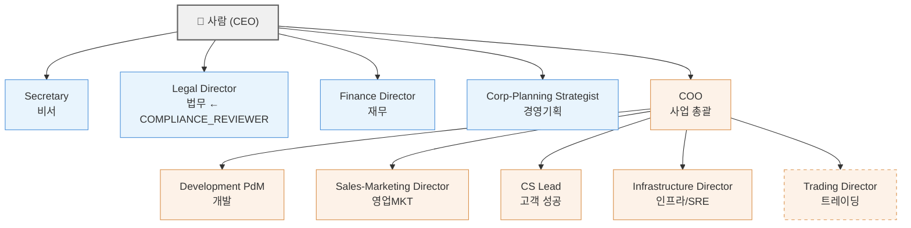

# 조직도 템플릿

## 개요

이 문서는 AnimaWorks에서 권장하는 조직 계층·부문 배치·부문 간 협업 흐름을 조감하기 위한 템플릿이다.
연매출 약 50억 엔 규모의 일본 IT 기업에서의 일반적인 조직 구조(스태프/라인 분리)를 기반으로 설계되었다.

### 사용 방법

1. **권장 조직도** 에서 스태프계·라인계의 전체 배치를 파악한다
2. **부문 디렉터리** 에서 각 팀의 상세 템플릿을 참조한다
3. **부문 간 핸드오프 맵** 에서 부문을 가로지르는 흐름을 확인한다
4. **단계적 도입 가이드** 에서 자기 조직 규모에 맞는 도입 단계를 선택한다

---

## 권장 조직도

### 조직 계층 (Mermaid)



### 스태프/라인 분류

| 부문 | 구분 | supervisor 권장 | 개요 | 템플릿 |
|------|------|----------------|------|--------|
| Secretary | 스태프 | `null`(CEO 직속) | 정보 트리아지·대행 전송·문서 작성 | `team-design/secretary/team.md` |
| Legal | 스태프 | `null`(CEO 직속) | 계약 리뷰·컴플라이언스 검증·법적 조사 | `team-design/legal/team.md` |
| Finance | 스태프 | `null`(CEO 직속) | 재무 분석·감사·데이터 수집 | `team-design/finance/team.md` |
| Corporate Planning | 스태프 | `null`(CEO 직속) | 전략 수립·사업 분석·KPI 추적 | `team-design/corporate-planning/team.md` |
| COO | 라인(통괄) | `null`(CEO 직속) | 위임 판단·부문 감시·경영 보고 | `team-design/coo/team.md` |
| Development | 라인 | COO | 계획·구현·리뷰·테스트 | `team-design/development/team.md` |
| Sales & Marketing | 라인 | COO | 콘텐츠 제작·리드 개발·파이프라인 관리 | `team-design/sales-marketing/team.md` |
| Customer Success | 라인 | COO | 온보딩·헬스 분석·VoC 집약 | `team-design/customer-success/team.md` |
| Infrastructure/SRE | 라인 | COO | 정기 모니터링·이상 감지·에스컬레이션 | `team-design/infrastructure/team.md` |
| Trading | 라인(생략 가능) | COO | 전략 수립·백테스트·bot 운용·리스크 감사 | `team-design/trading/team.md` |

> **Trading은 도메인 고유**(금융·암호자산 등)이며, 일반 IT 기업에서는 생략 가능하다. 위 Mermaid 도에서는 파선 테두리로 표현하고 있다.

### 설계 근거

- **스태프계는 모두 `supervisor: null`(CEO 직속)**: 법무·재무는 거버넌스상 독립성을 보장하기 위해 COO 산하에 두지 않는다. 경영기획은 CEO의 의사결정 지원 기능이며, 비서는 사람과의 직접적인 접점(EA)으로 CEO 직속
- **라인계는 COO 통괄**: 사업 집행에 관여하는 부문(개발·영업·CS·인프라 등)은 COO가 일원적으로 관리한다. 사람(CEO)의 직속 수를 적정하게 유지하는 스팬 오브 컨트롤 이점도 있음

### COMPLIANCE_REVIEWER 배치

**권장: Legal Director가 COMPLIANCE_REVIEWER를 겸임한다.**

- CEO 직속의 법무가 독립적 입장에서 컴플라이언스 검증을 수행하는 구조가 자연스럽다
- Sales-Marketing의 `compliance-review.md` 흐름의 검증 담당으로 Legal Director를 상정
- 조직 규모가 확대되면 법무 팀 내에 전임 Legal Verifier를 배치 가능(`team-design/legal/team.md` 참조)

---

## 부문 디렉터리

| # | 부문 | 구분 | supervisor 권장 | 역할 구성 | 권장 `--role` | 템플릿 경로 |
|---|------|------|----------------|-----------|-------------|-------------|
| 1 | Secretary | 스태프 | `null` | Secretary | general | `team-design/secretary/team.md` |
| 2 | Legal | 스태프 | `null` | Director + Verifier + Researcher | manager / researcher | `team-design/legal/team.md` |
| 3 | Finance | 스태프 | `null` | Director + Auditor + Analyst + Collector | manager / ops | `team-design/finance/team.md` |
| 4 | Corporate Planning | 스태프 | `null` | Strategist + Analyst + Coordinator | manager / researcher | `team-design/corporate-planning/team.md` |
| 5 | COO | 라인 통괄 | `null` | COO | manager | `team-design/coo/team.md` |
| 6 | Development | 라인 | COO | PdM + Engineer + Reviewer + Tester | engineer / manager | `team-design/development/team.md` |
| 7 | Sales & Marketing | 라인 | COO | Director + Creator + SDR + Researcher | manager / writer | `team-design/sales-marketing/team.md` |
| 8 | Customer Success | 라인 | COO | CS Lead + Support | manager / general | `team-design/customer-success/team.md` |
| 9 | Infrastructure/SRE | 라인 | COO | Infra Director + Monitor | ops | `team-design/infrastructure/team.md` |
| 10 | Trading | 라인(생략 가능) | COO | Director + Analyst + Engineer + Auditor | manager / engineer | `team-design/trading/team.md` |

---

## 부문 간 핸드오프 맵

부문을 가로지르는 주요 정보 흐름을 아래에 나열한다. 각 흐름의 상세는 해당 팀의 `team.md`를 참조.

| # | From | To | 트리거 | 인계 문서 | 채널 |
|---|------|-----|--------|----------|------|
| 1 | Sales-Marketing Director | CS Lead | 계약 성립 시 | `cs-handoff.md` | `delegate_task` |
| 2 | Sales-Marketing Director | Legal Director | 컴플라이언스 리스크 감지 | `compliance-review.md` | `send_message` |
| 3 | CS Lead | COO | VoC 정기 리포트 | `voc-report.md` | `send_message` (intent: report) |
| 4 | COO | Development PdM | VoC에서의 프로덕트 피드백 | `voc-report.md`(COO 경유 전달) | `send_message` or `delegate_task` |
| 5 | Infrastructure Director | COO | 정기 집약 보고 | 집약 보고 템플릿 | `send_message` (intent: report) |
| 6 | Infrastructure Director | COO + Development | CRITICAL 장애 에스컬레이션 | 인시던트 보고 | `send_message` + `call_human` |
| 7 | Corporate-Planning Strategist | COO | 전략 리포트·시책 제안 | `strategy-report.md` | `send_message` (intent: report) |
| 8 | Corporate-Planning Coordinator | 각 부문 | 시책 전달·KPI 추적 | 시책 통지 | `send_message` or `post_channel` |
| 9 | Secretary | 각 팀 | 외부 메시지 수신 트리아지 | 트리아지 결과 | `send_message`(분배처 판정) |
| 10 | 각 팀 Director/Lead | Secretary | 외부 채널 전송 의뢰 | 전송 의뢰(승인 흐름) | `send_message` |

### 흐름 보충

- **#1 cs-handoff**: 영업에서 CS로의 고객 인계. 계약 조건·고객 정보·온보딩 일정을 포함
- **#2 compliance-review**: 영업 활동 중 컴플라이언스 리스크가 감지되면 법무가 독립 검증. Legal Director가 COMPLIANCE_REVIEWER로서 판정
- **#3, #4 VoC 피드백 루프**: CS → COO → Development 경로로 고객의 목소리가 프로덕트 개선에 반영
- **#6 CRITICAL 에스컬레이션**: 인프라 장애가 CRITICAL에 도달하면 COO와 Development에 동시 통지하고, `call_human`으로 사람에게도 에스컬레이션
- **#9, #10 비서 허브**: 외부 채널(Gmail, Chatwork 등)과의 송수신은 비서가 집약. 수신은 트리아지 후 분배, 송신은 승인 흐름을 거쳐 대행

---

## 에스컬레이션 경로

### 라인계(COO 산하)

```
팀 내에서 해결을 시도
  ↓ 해결 불가
COO에 에스컬레이션 (send_message, intent: report)
  ↓ COO 판단으로 해결 불가 / 사람 승인 필요
call_human으로 사람에게 에스컬레이션
```

### 스태프계(CEO 직속)

```
팀 내에서 해결을 시도
  ↓ 해결 불가 / 사람 승인 필요
call_human으로 사람에게 직접 에스컬레이션
```

> 스태프계는 `supervisor: null`이므로 중간에 Anima 상사가 없다. 중요한 판단·승인은 직접 `call_human`을 사용한다.

### CRITICAL 장애 시

```
Infrastructure Director가 감지
  ↓ 동시 발보
├── COO에 send_message (intent: report)
├── Development PdM에 send_message (기술 대응 의뢰)
└── call_human으로 사람에게 통지
```

---

## 단계적 도입 가이드

전 부문을 한꺼번에 세울 필요는 없다. 조직의 성장에 맞추어 단계적으로 팀을 추가한다.

### Stage 1: 퍼스널 어시스턴트 (1명)

| Anima | supervisor | 역할 |
|-------|-----------|------|
| Secretary | `null` | 정보 트리아지·일정 관리·대행 전송 |

최소 구성. 사람이 직접 소통하는 상대가 1명뿐. 외부 채널 연동과 일상적인 어시스턴트 업무를 담당한다.

### Stage 2: 개발 팀 추가 (3-5명)

| Anima | supervisor | 역할 |
|-------|-----------|------|
| Secretary | `null` | Stage 1과 동일 |
| COO | `null` | 사업 총괄·개발 팀 관리 |
| Development PdM | COO | 기획·관리(Engineer 등은 겸임 또는 단계적 추가) |

사업의 핵심인 개발 기능을 추가. COO가 라인 부문 관리를 시작한다. 개발 팀 내 역할(Engineer, Reviewer, Tester)은 `team-design/development/team.md`의 스케일링 가이드에 따라 단계적으로 추가한다.

### Stage 3: 백오피스 추가 (6-8명)

| Anima | supervisor | 역할 |
|-------|-----------|------|
| (Stage 2 전원) | — | — |
| Legal Director | `null` | 계약 리뷰·컴플라이언스(COMPLIANCE_REVIEWER 겸임) |
| Finance Director | `null` | 재무 분석·예산 관리 |
| *또는* Infrastructure Director | COO | 모니터링·운용(개발의 인프라 요건이 선행하는 경우) |

거버넌스 기반을 확립. 법무·재무는 CEO 직속으로 독립성을 확보한다. 인프라는 개발 규모에 따라 조기 추가도 가능.

### Stage 4: 고객 대응 추가 (8-12명)

| Anima | supervisor | 역할 |
|-------|-----------|------|
| (Stage 3 전원) | — | — |
| Sales-Marketing Director | COO | 리드 획득·콘텐츠 제작 |
| CS Lead | COO | 온보딩·고객 헬스 관리 |
| Infrastructure Director | COO | (Stage 3에서 미추가인 경우) |

고객 획득부터 성공까지의 풀 퍼널을 구축. cs-handoff(영업→CS 인계)와 VoC 피드백 루프가 작동하기 시작한다.

### Stage 5: 풀 구성 (12명 이상)

| Anima | supervisor | 역할 |
|-------|-----------|------|
| (Stage 4 전원) | — | — |
| Corporate-Planning Strategist | `null` | 전략 수립·KPI 추적 |
| Trading Director | COO | *도메인 고유 — 생략 가능* |
| 각 팀 내 역할 확장 | — | 각 team.md의 스케일링 섹션 참조 |

경영기획에 의한 전략적 의사결정 지원을 추가. 전체 핸드오프 맵이 완전히 가동하는 상태. 각 팀 내 역할 확장(Engineer 복수화, Support 추가 등)은 각 team.md를 참조.

---

## 커스터마이즈 지침

### Trading 생략

Trading 팀은 금융·암호자산 등의 도메인 고유 기능. 일반 IT 기업에서는 생략해도 문제없다. 생략 시 조직도에서 Trading을 제거하면 되며, 핸드오프 맵에 대한 영향은 없다(Trading은 다른 부문에서 흐름을 받지 않는다).

### COMPLIANCE_REVIEWER 배치 변경

Legal Director가 COMPLIANCE_REVIEWER를 겸임하는 구성을 권장하지만, 아래와 같은 변경도 가능하다:

- **전임 Legal Verifier 배치**: 법무 팀 내에 검증 전임 역할을 추가(`team-design/legal/team.md` 참조)
- **다른 CEO 직속 Anima에 할당**: 거버넌스상 독립성이 유지되는 한 가능

### 스태프계의 단계적 추가

Stage 1-5는 하나의 예시이다. 실제 우선순위는 사업 상황에 따라 변경해도 된다:

- 법적 리스크가 높은 업종 → Stage 2에서 Legal을 선행 추가
- 데이터 드리븐 사업 → Stage 2에서 Finance의 Analyst 역할을 선행 추가
- SaaS 사업 → Stage 3에서 CS를 선행 추가

### 팀 내 스케일링

각 팀 내 역할 확장은 각 team.md의 스케일링 섹션에 따른다:

| 팀 | 스케일링 참조 |
|----|-------------|
| Development | `team-design/development/team.md` §스케일링 |
| Legal | `team-design/legal/team.md` §스케일링 |
| Finance | `team-design/finance/team.md` §스케일링 |
| Sales & Marketing | `team-design/sales-marketing/team.md` §스케일링 |
| Customer Success | `team-design/customer-success/team.md` §스케일링 |
| Corporate Planning | `team-design/corporate-planning/team.md` §스케일링 |
| Infrastructure/SRE | `team-design/infrastructure/team.md` §스케일링 |
| Trading | `team-design/trading/team.md` §스케일링 |
